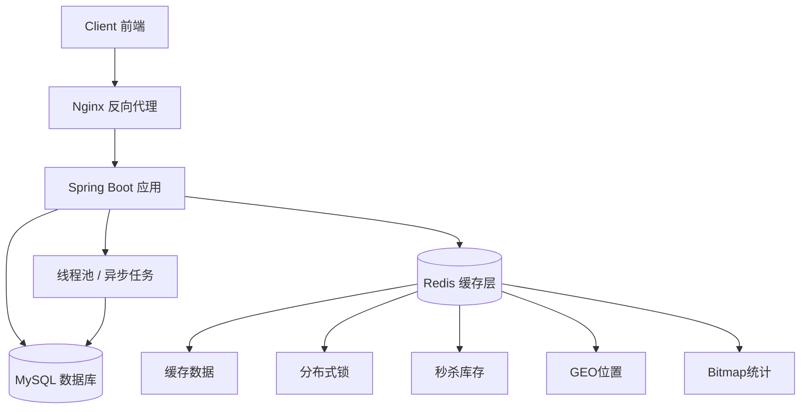
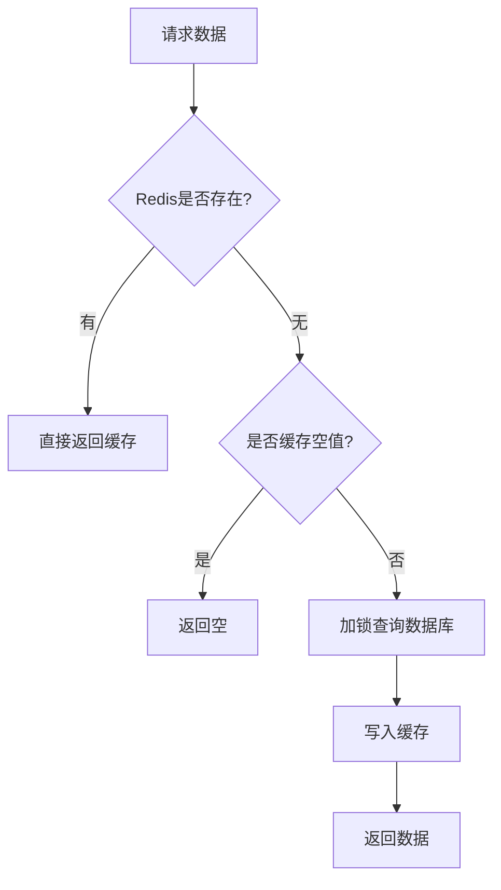
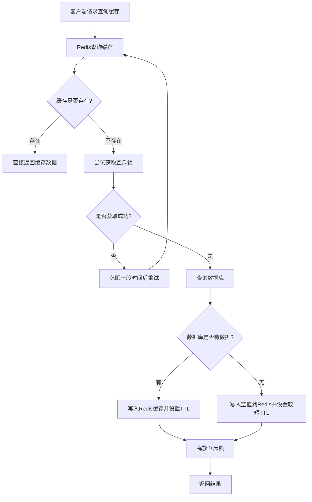
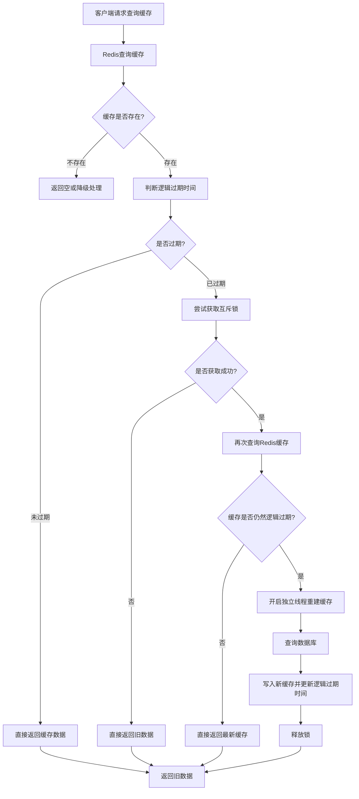
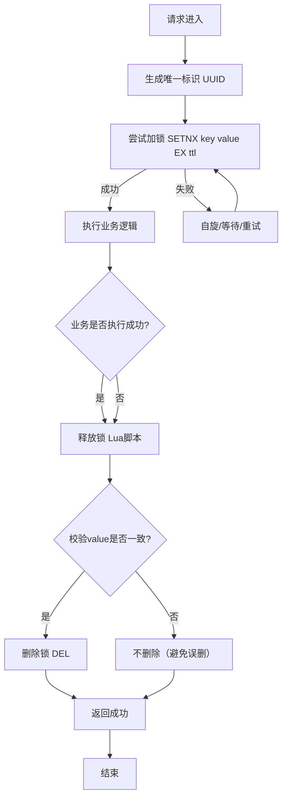

# 🍽️ 黑马点评（DianPing Clone）

一个基于 Spring Boot + Redis + MySQL 构建的本地生活点评系统，支持用户登录、商户浏览、优惠券秒杀、缓存优化等核心功能。

> 📌 项目重点：高并发处理 + 缓存设计 + 分布式锁 + 秒杀系统

---

## 🚀 项目亮点

- 🔥 Redis 多种数据结构实战（String / Hash / Set / ZSet / Bitmap）
- ⚡ 秒杀系统：Redis + Lua 实现原子扣减库存
- 🧠 缓存优化：缓存穿透、缓存击穿、缓存雪崩解决方案
- 🔒 分布式锁：基于 Redis 实现高并发控制
- 📍 GEO 数据：实现“附近商户”功能
- 📊 UV 统计：基于 Bitmap 实现高效统计
- 🧵 异步处理：使用消息队列思想（或线程池）提升性能
- 📦 登录优化：Token + Redis 替代 Session

---

**总体架构**


---

## 🧩 技术栈

| 技术 | 说明 |
|------|------|
| Spring Boot | 后端核心框架 |
| MySQL | 数据存储 |
| Redis | 缓存 / 分布式锁 / 秒杀 |
| MyBatis-Plus | ORM 框架 |
| Nginx | 反向代理 |
| Docker（可选） | 部署环境 |
| Lua | 原子操作（秒杀） |

---

## 📦 核心功能

### 👤 用户模块
- 手机号验证码登录
- Token 存储 Redis
- 登录态校验拦截器

### 🏪 商户模块
- 商户分类查询
- 商户详情
- 商户缓存（缓存穿透解决）

### 🎯 优惠券秒杀
- 高并发秒杀
- Redis 预减库存
- Lua 保证原子性
- 一人一单控制

### 📍 附近商户
- 使用 Redis GEO 实现距离排序

### 📊 数据统计
- UV 统计（Bitmap）
- 点赞功能（Set / ZSet）

---

## ⚙️ 缓存设计

### 缓存穿透
- 使用 **空值缓存**


### 缓存击穿
- 使用 **互斥锁**



- **逻辑过期**


### 缓存雪崩
- TTL 随机值
- 多级缓存

---

## ⚡ 秒杀系统设计

核心流程：

1. 用户请求秒杀接口
2. Redis Lua 脚本执行：
   - 判断库存
   - 判断是否重复下单
   - 扣减库存
3. 返回抢购结果
4. 异步创建订单（防止阻塞）

---

## 🔒 分布式锁实现

- 基于 Redis SETNX 实现
- 使用 UUID 防止误删锁
- Lua 脚本保证释放锁的原子性


---

## 🧠 项目优化点

- 使用 Redis 替代 Session，提升性能
- 秒杀场景避免超卖问题
- 使用缓存提高查询性能
- 使用线程池
- 合理设计数据库索引

---

## 📁 项目结构


├── controller
├── service
├── mapper
├── entity
├── config
├── utils
|—— dto


---

分层讲解

1️⃣ 网关层（Nginx）
反向代理
负载均衡

2️⃣ 应用层（Spring Boot）
处理业务逻辑
提供 REST API
控制流程（秒杀、缓存、登录）

3️⃣ 缓存层（Redis）

👉 核心亮点：

缓存热点数据（减少 DB 压力）
分布式锁（控制并发）
秒杀库存（高并发核心）
GEO（附近商户）
Bitmap（UV统计）

4️⃣ 数据层（MySQL）
持久化数据
最终一致性

5️⃣ 异步层（线程池）

👉 用来：

削峰
解耦业务
防止请求阻塞

## 🛠️ 启动方式

```bash
 1. 克隆项目
git clone https://github.com/kamisheng/hmdp-kami.git

 2. 启动 Redis
redis-server

 3. 修改 application.yml 数据库配置

 4. 启动项目
mvn spring-boot:run
```
📸 项目截图（可选）

这里可以放接口测试图 / 前端页面截图

📌 后续优化方向
引入 Kafka / RabbitMQ 实现真正异步削峰
使用 Redisson 优化分布式锁
引入 ElasticSearch 实现搜索
微服务拆分（Spring Cloud）
接入限流组件（Sentinel）

👨‍💻 作者
GitHub: https://github.com/kamisheng
📄 License

MIT


---
